# Active Directory — Complete Field Notes
> A practical guide covering Windows Server AD, Azure AD, administration tools, replication, sites, and security implications.  
> Screenshots are numbered in order. More sections will be added.

---

# PART 1 — Understanding Active Directory

---

## 1. What Is Active Directory?

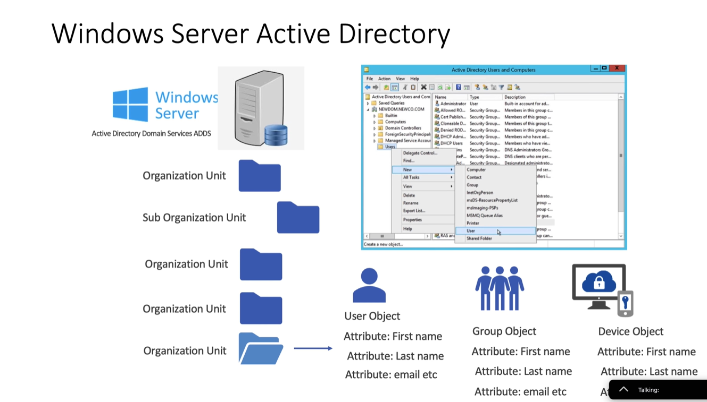

**Active Directory Domain Services (AD DS)** is a directory service built into Windows Server. Think of it as the central "phone book" and "security guard" of a corporate network — it knows who every user, computer, and resource is, and it decides who can access what.

### Core Building Blocks

**Organization Units (OUs)** are like folders inside AD. You use them to group users, computers, and groups logically — for example, by department or location. OUs can be nested (Sub-OUs inside OUs) to reflect real organizational structure.

**Objects** are the actual items stored inside OUs:

| Object Type | What It Represents | Key Attributes |
|---|---|---|
| **User Object** | A person with an account | First name, last name, email, password hash |
| **Group Object** | A collection of users/computers | Members list, group scope, group type |
| **Device/Computer Object** | A domain-joined machine | Hostname, OS version, last logon |

> Objects are created via right-click → **New** inside Active Directory Users and Computers (ADUC).

###  Why This Matters for Security
Every user, computer, and service in a Windows enterprise runs through AD. **Compromising AD means compromising the entire organization.** Attackers target AD because:
- It holds credentials (NTLM hashes, Kerberos tickets)
- It controls access to every resource
- Domain Admin = God-level access to everything

---

## 2. Replication — Keeping DCs in Sync

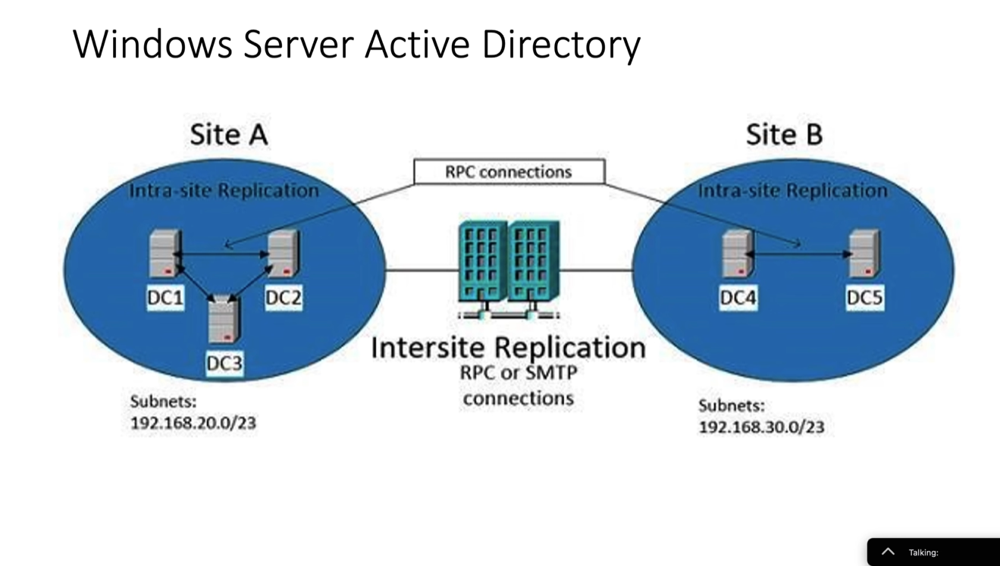

When you have multiple **Domain Controllers (DCs)**, they must all have the same data. This is handled through **replication**.

### Two Types of Replication

**Intra-site Replication** happens between DCs within the same physical location. It is fast and frequent because the network link is assumed to be fast and cheap.

**Intersite Replication** happens between DCs in different physical locations (e.g., HQ and a branch office). It uses scheduled intervals to avoid saturating WAN links.

```
Site A (192.168.20.0/23)          Site B (192.168.30.0/23)
┌─────────────────────┐           ┌─────────────────────┐
│  DC1 ←→ DC2        │           │  DC4 → DC5          │
│      ↕              │──RPC/SMTP─│                     │
│     DC3             │           │                     │
└─────────────────────┘           └─────────────────────┘
       Intra-site                        Intra-site
              └──── Intersite ────┘
```

**Protocols used:**
- **RPC over IP** — default for both intra and intersite
- **SMTP** — only for intersite, when RPC is not possible (e.g., unreliable WAN)

###  Security Angle
If an attacker performs a **DCSync attack**, they mimic the replication process and pull password hashes directly from a DC — without ever logging into it. This is why replication traffic should be monitored and DC access tightly restricted.

---

## 3. Domain Trees and Forests

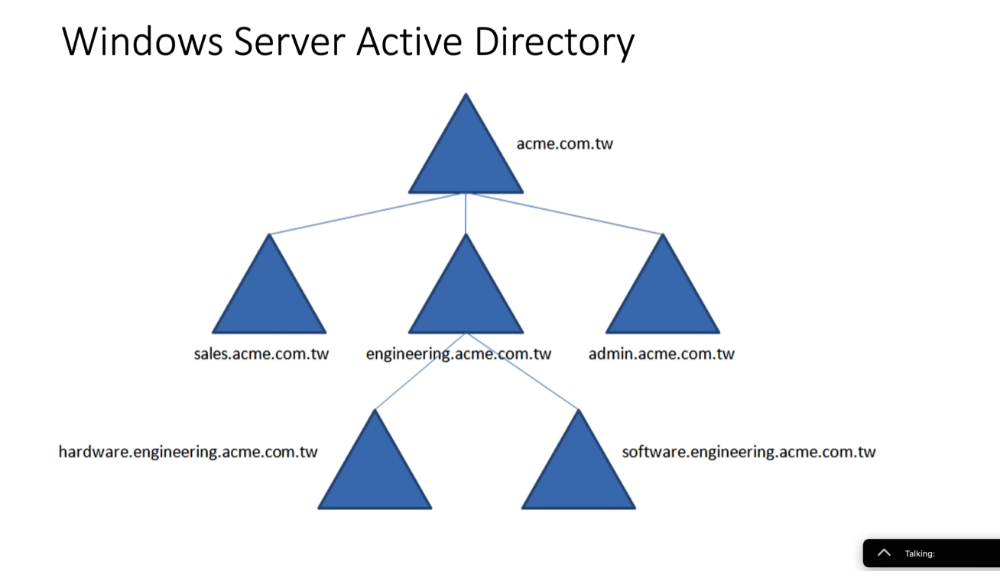

AD is not limited to a single domain. Large organizations use **trees** and **forests** to structure multiple domains.

```
acme.com.tw                        ← Root Domain (Forest Root)
├── sales.acme.com.tw              ← Child Domain
├── engineering.acme.com.tw        ← Child Domain
│   ├── hardware.engineering.acme.com.tw
│   └── software.engineering.acme.com.tw
└── admin.acme.com.tw
```

**Domain Tree** — A set of domains that share a contiguous namespace (e.g., all under `acme.com.tw`). Parent-child domains automatically have a **two-way transitive trust**.

**Forest** — The top-level container. Multiple trees can exist in one forest. All domains in a forest share a common **Schema** and **Global Catalog**.

**Trust relationships** allow users in one domain to access resources in another. Trusts can be:
- **Transitive** (flows through the chain)
- **Non-transitive** (limited to two specific domains)
- **One-way** or **Two-way**

###  Security Angle
Trust relationships are a major attack path. If Domain A trusts Domain B, compromising Domain B can be used to pivot into Domain A. Attackers use **trust abuse** and **SID history injection** to cross domain boundaries. Always audit and minimize trusts.

---

# PART 2 — Azure Active Directory

---

## 4. Azure AD — Identity as a Service (IDaaS)

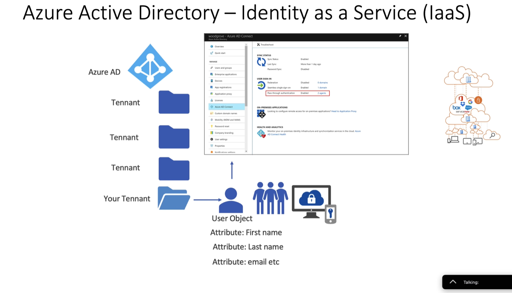

**Azure Active Directory (Azure AD / Microsoft Entra ID)** is the cloud-based counterpart to on-premises AD DS. Instead of running on a Windows Server in your datacenter, it lives in Microsoft's cloud.

### Key Concepts

**Tenant** — Your organization's dedicated, isolated instance of Azure AD. Every company that signs up for Microsoft 365 or Azure gets a tenant. Think of it like your own private AD in the cloud.

**Azure AD Connect** — A sync tool that bridges on-premises AD DS with Azure AD. This lets users use the same credentials for both local resources and cloud services.

Features visible in the Azure AD Connect screen:
- **Sync Status** — Shows last sync time and whether password sync is enabled
- **Pass-through Authentication** — Validates passwords on-premises instead of in the cloud
- **Seamless Single Sign-On (SSO)** — Users stay logged in across cloud apps without re-entering credentials

Azure AD integrates natively with services like **Office 365, Box, Salesforce, ServiceNow, Google Workspace**, and thousands more via SAML/OAuth.

### On-premises AD vs. Azure AD

| Feature | AD DS (On-premises) | Azure AD |
|---|---|---|
| Structure | OUs, GPOs, Domain | Tenants, Conditional Access |
| Protocol | Kerberos, LDAP, NTLM | OAuth 2.0, SAML, OpenID Connect |
| Joined devices | Domain Join | Azure AD Join / Hybrid Join |
| Management | ADUC, GPMC | Azure Portal, Entra Admin Center |

###  Security Angle
Azure AD is a prime target for attackers. **Password spray attacks**, **MFA bypass**, and **OAuth token theft** are common attack vectors. Misconfigured **Conditional Access policies** or **Guest accounts with excessive permissions** are frequent entry points. Always enable MFA and monitor sign-in logs.

---

## 5. Azure Enterprise Enrollment Structure

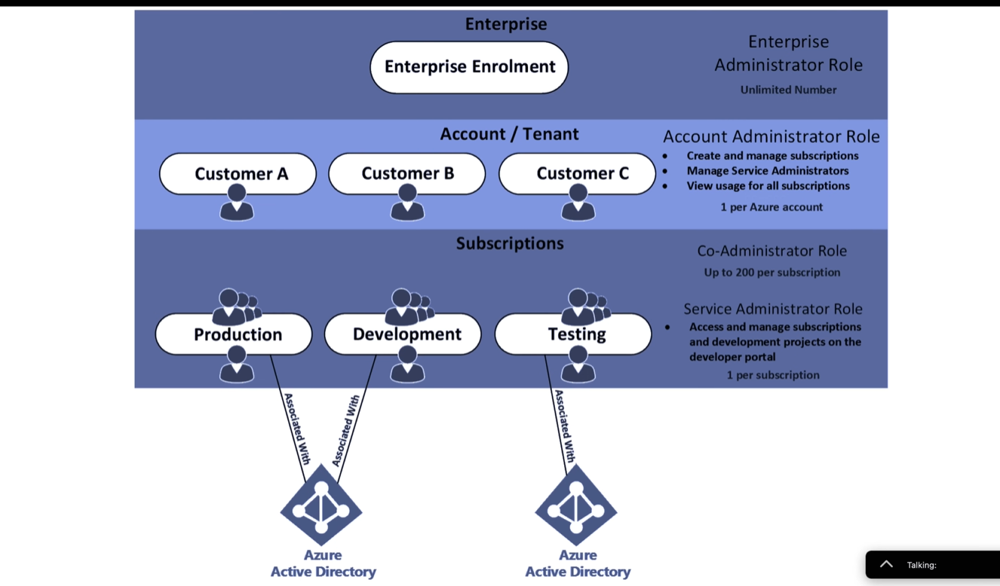

For large organizations, Microsoft offers a layered management structure:

```
Enterprise Enrolment
└── Account / Tenant  (Customer A, B, C...)
    └── Subscriptions  (Production, Development, Testing...)
        └── Azure Active Directory
```

### Administrative Roles at Each Layer

**Enterprise Administrator**
- Highest level of control
- Manages all accounts and billing
- Unlimited number allowed

**Account Administrator** *(1 per Azure account)*
- Creates and manages subscriptions
- Manages Service Administrators
- Views usage across all subscriptions

**Co-Administrator** *(up to 200 per subscription)*
- Has same access as Service Administrator but cannot change the Service Admin

**Service Administrator** *(1 per subscription)*
- Manages resources within the subscription
- Full access to the Azure developer portal

> Each subscription is **associated with one Azure AD tenant** — this controls which users and apps can access that subscription's resources.

###  Security Angle
Misconfigured subscription-level permissions are a massive risk. A developer accidentally given **Owner** instead of **Contributor** on a production subscription can delete or exfiltrate everything. Apply **least privilege** and use **Azure RBAC** for granular control.

---

# PART 3 — Hands-On Administration

---

## 6. Server Manager — Tools Menu

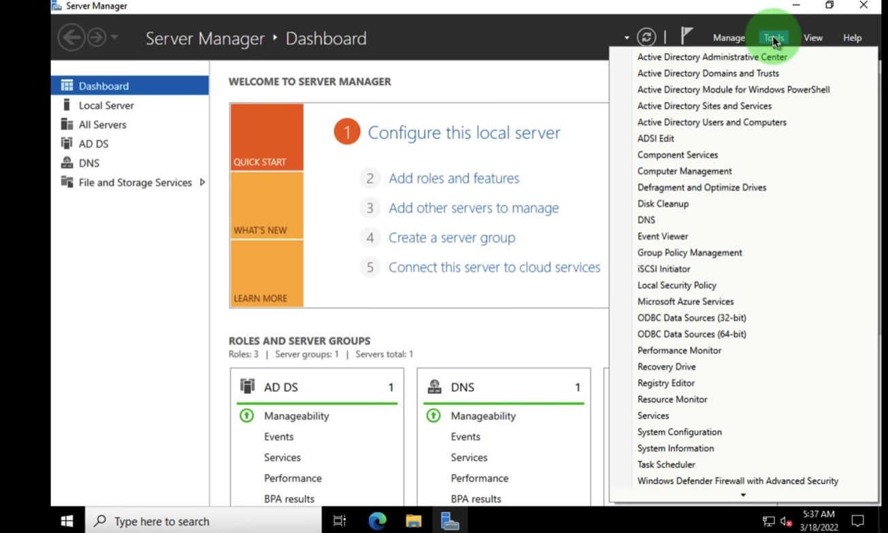

The **Tools** menu in Server Manager is the central hub for accessing all AD management consoles.

| Tool | Purpose |
|---|---|
| **AD Administrative Center** | Modern GUI for AD management; built on PowerShell. Shows PS commands for every action. |
| **AD Domains and Trusts** | Manage trust relationships between domains. View/change functional levels. |
| **AD Module for Windows PowerShell** | Opens a PS session with the AD module pre-loaded. Essential for scripting and bulk operations. |
| **AD Sites and Services** | Manage physical site topology and replication between sites. |
| **AD Users and Computers (ADUC)** | Day-to-day user, group, computer, and OU management. Most-used AD tool. |
| **ADSI Edit** | Low-level attribute editor. Direct access to the AD schema. Dangerous if misused. |
| **DNS** | Manage DNS zones — critical since AD depends heavily on DNS. |
| **Event Viewer** | View security, system, and application logs — key for incident response. |
| **Group Policy Management** | Create, edit, and link GPOs to control settings across the domain. |

###  Security Angle
**ADSI Edit** is particularly dangerous — it allows modifying attributes that ADUC hides, including `msDS-AllowedToDelegateTo` (used in Kerberos delegation attacks). Restrict access to ADSI Edit and audit its use.

---

## 7. Server Manager — Manage Menu

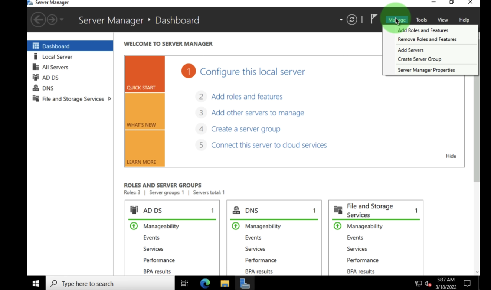

The **Manage** menu handles server roles and infrastructure:

- **Add Roles and Features** → Install server roles (like AD DS, DNS, DHCP) using a wizard
- **Remove Roles and Features** → Cleanly uninstall roles
- **Add Servers** → Add remote servers to manage centrally from this Server Manager instance
- **Create Server Group** → Group multiple servers for easier monitoring

---

## 8. Installing a Role — Server Selection

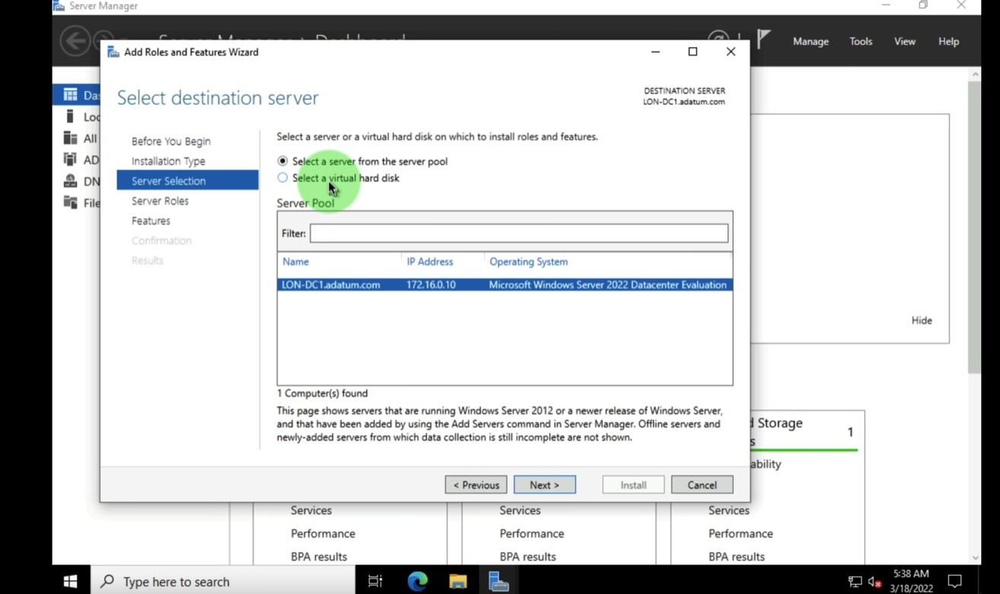

When running the **Add Roles and Features Wizard**, the Server Selection step lets you choose:

- **Select a server from the server pool** — Install the role on a running server. The server pool lists all servers added to Server Manager (name, IP, OS).
- **Select a virtual hard disk** — Install onto an offline VHD (useful for preparing VM images).

> In this example: `LON-DC1.adatum.com` running **Windows Server 2022 Datacenter Evaluation** at `172.16.0.10`.

---

## 9. Installing a Role — Server Roles


This step shows all available Windows Server roles. Key AD-related roles:

**Active Directory Certificate Services (AD CS)**
Issues and manages digital certificates. Used for internal PKI, smart card logon, and securing internal communications with TLS.

**Active Directory Domain Services (AD DS)** ✅ *(already installed)*
The core role. Makes a server a Domain Controller. Required for all AD functionality.

**Active Directory Federation Services (AD FS)**
Enables SSO between organizations (federated identity). Used for cross-organization trust without sharing passwords.

**Active Directory Lightweight Directory Services (AD LDS)**
A standalone LDAP directory — no domain required. Used for application-specific directories.

**Active Directory Rights Management Services (AD RMS)**
Protects documents and emails by controlling what recipients can do with them (read-only, no print, expiry).

**DNS Server** ✅ *(already installed)*
Absolutely required for AD to function. AD uses DNS for locating DCs, sites, and services via SRV records.

###  Security Angle
**AD CS is one of the most abused AD components** in modern attacks. Misconfigurations in certificate templates (ESC1–ESC8 vulnerabilities) allow attackers to forge certificates and authenticate as any user — including Domain Admins. Always audit certificate templates with **Certify** or **Certipy**.

---

## 10. Installing a Role — Features

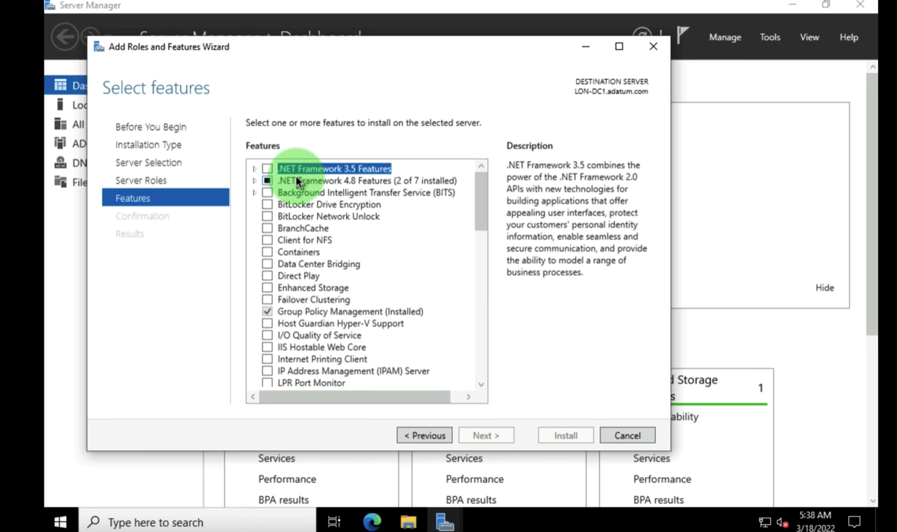

Features add optional functionality to Windows Server.

| Feature | Why It Matters |
|---|---|
| **.NET Framework 3.5 / 4.8** | Required by many enterprise apps. AD CS and other tools depend on it. |
| **Group Policy Management**  | Manage GPOs — essential for pushing security baselines, software, scripts. |
| **Failover Clustering** | High availability — file servers and SQL servers often need this alongside AD. |
| **BitLocker Drive Encryption** | Encrypts disk volumes. Protects data on DCs if physical theft occurs. |
| **IPAM Server** | Centralized IP address management across the domain. |
| **Background Intelligent Transfer (BITS)** | Used by Windows Update and SCCM for low-priority file transfers. |

---

## 11. Opening Active Directory Users and Computers

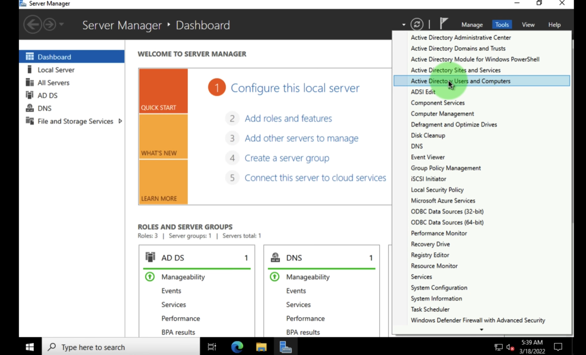

`Server Manager → Tools → Active Directory Users and Computers`

**ADUC** is the primary tool for day-to-day AD administration. It lets you manage every user, group, computer, and OU in the domain through a graphical interface.

---

## 12. ADUC — The Domain Structure

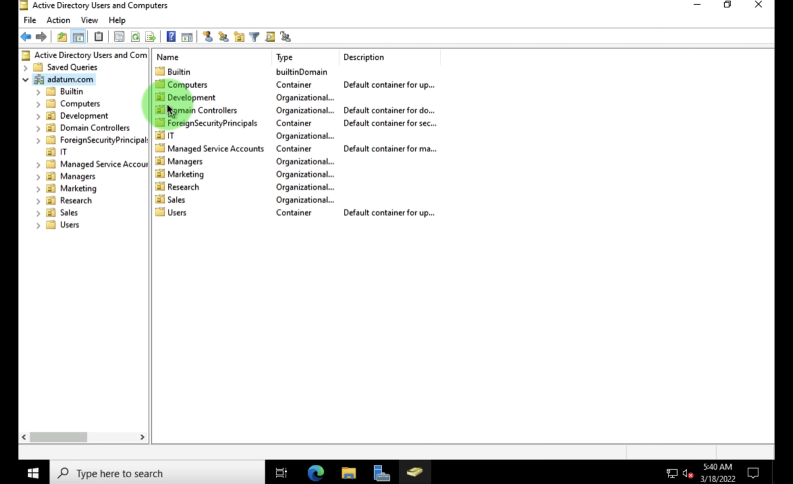

When you open ADUC for `adatum.com`, you see default containers and custom OUs:

**Default Containers** *(cannot have GPOs applied directly)*:

| Container | Purpose |
|---|---|
| **Builtin** | Built-in security groups (Administrators, Backup Operators, etc.) |
| **Computers** | Domain-joined computers land here by default — move them to proper OUs |
| **ForeignSecurityPrincipals** | Accounts from trusted external domains |
| **Managed Service Accounts** | Accounts used by services (auto-managed passwords) |
| **Users** | Default container for new user accounts — not ideal for production |

**Custom OUs** *(admin-created, support GPOs)*:
Development, IT, Managers, Marketing, Research, Sales — created to mirror the organization's structure.

> **Best practice:** Never leave users and computers in default containers. Move them into proper OUs so GPOs apply correctly.

###  Security Angle
Default containers like `CN=Computers` and `CN=Users` do not inherit OU-level GPOs. Computers sitting in the default Computers container will not receive security baselines — a common misconfiguration that leaves machines unprotected.

---

## 13. Creating New Objects — Right-Click Menu

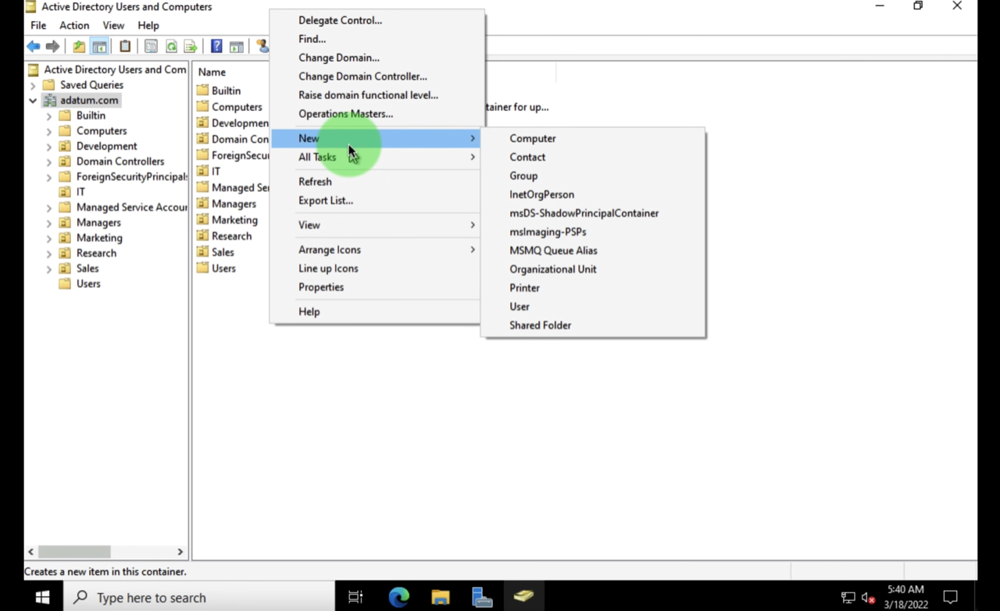

Right-clicking on the domain or an OU and choosing **New** reveals what you can create:

| Object | Use Case |
|---|---|
| **Computer** | Pre-stage a computer account before joining the domain |
| **Contact** | Non-domain address book entry (no login capability) |
| **Group** | Security or distribution group |
| **InetOrgPerson** | LDAP-compatible user type for cross-platform directories |
| **Organizational Unit** | Create a new OU for organizing objects |
| **Printer** | Publish a shared printer in AD |
| **User** | Create a new domain user account |
| **Shared Folder** | Publish a shared folder path in AD |

---

## 14. Creating a New OU

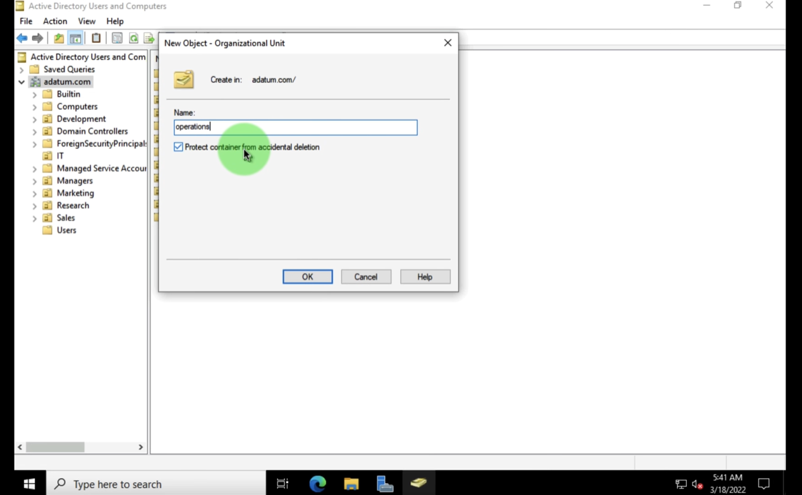

**New Object — Organizational Unit** dialog:

- **Name:** The OU name (e.g., `operations`)
- **Protect container from accidental deletion**  — Sets an ACL preventing the OU from being deleted through the standard delete button. To delete a protected OU, uncheck this in Properties → Object tab (requires **Advanced Features** enabled in View menu).

> Always leave this checked in production. Accidentally deleting an OU with hundreds of users and groups is a serious incident — recovery requires restoring from backup unless the Recycle Bin is enabled.

---

## 15. Creating a New User — Account Details

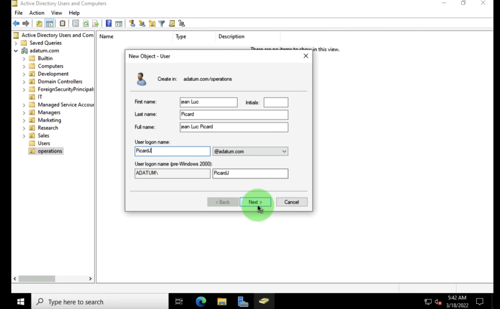

**New Object — User** wizard, Step 1:

| Field | Example | Notes |
|---|---|---|
| First name | `Jean Luc` | Displayed name part |
| Last name | `Picard` | Displayed name part |
| Full name | `Jean Luc Picard` | Auto-generated, can be customized |
| **User logon name** | `PicardJ@adatum.com` | UPN — used for modern logins |
| **Pre-Windows 2000 logon** | `ADATUM\PicardJ` | NetBIOS format — used by legacy apps |

The UPN (`PicardJ@adatum.com`) is what users type at the Windows login screen or when signing into Microsoft 365.

###  Security Angle
**User logon names follow predictable patterns** (firstname.lastname, firstinitial+lastname, etc.). Attackers enumerate AD users via LDAP or Kerberos (AS-REQ without pre-auth) to build valid username lists for password spray attacks. Enable **Audit Account Logon Events** and deploy honeypot (decoy) accounts to detect enumeration attempts.

---

## 16. Creating a New User — Password Options

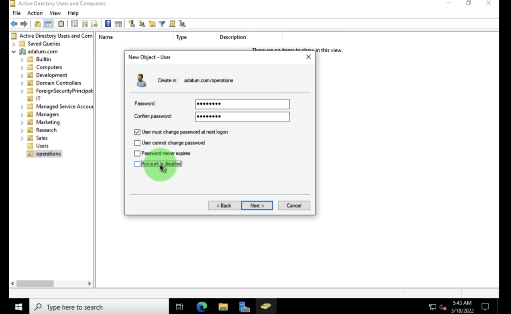

Step 2 sets the initial password and account flags:

| Option | What It Does | When to Use |
|---|---|---|
| **User must change password at next logon**  | Forces password reset on first login | Always use for new accounts |
| **User cannot change password** | Locks the password — only admins can change it | Service accounts, shared accounts |
| **Password never expires** | Bypasses the domain password policy expiry | Avoid for humans; use gMSA for service accounts |
| **Account is disabled** | Account exists but cannot log in | Pre-creating accounts or suspending access |

###  Security Angle
**"Password never expires"** combined with a weak password is one of the most common findings in AD security audits. Service accounts with old, never-expiring passwords are prime Kerberoasting targets. **Group Managed Service Accounts (gMSA)** solve this — AD manages 120+ character random passwords automatically, rotated on schedule.

---

## 17. Creating a New Group

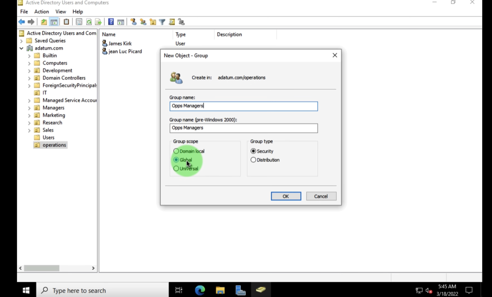

**New Object — Group** dialog.

### Group Scope — This Is Critical

| Scope | Members Can Come From | Can Be Used In |
|---|---|---|
| **Domain Local** | Any domain in the forest | Only the domain where it was created |
| **Global**  | Only the same domain | Any domain in the forest |
| **Universal** | Any domain in the forest | Any domain in the forest |

**The Microsoft recommended model (AGDLP):**
```
Accounts → Global Groups → Domain Local Groups → Permissions
```
Users go into **Global** groups (by department/role). Global groups go into **Domain Local** groups (by resource). Domain Local groups get **permissions** assigned on the actual resource.

### Group Type

**Security Group** — Used for assigning permissions to resources (file shares, printers, applications). This is the standard choice.

**Distribution Group** — Email-only list. No security permissions. Used with Exchange/Outlook.

###  Security Angle
**Nested group membership** creates blind spots. A user may be an effective Domain Admin through five layers of nested groups that nobody tracks. Tools like **BloodHound** map exactly these attack paths and show the shortest route from any user to Domain Admin. Run regular AD group audits and use **PingCastle** or **Purple Knight** to surface over-privileged group nesting.

---

## 18. Adding a User to a Group

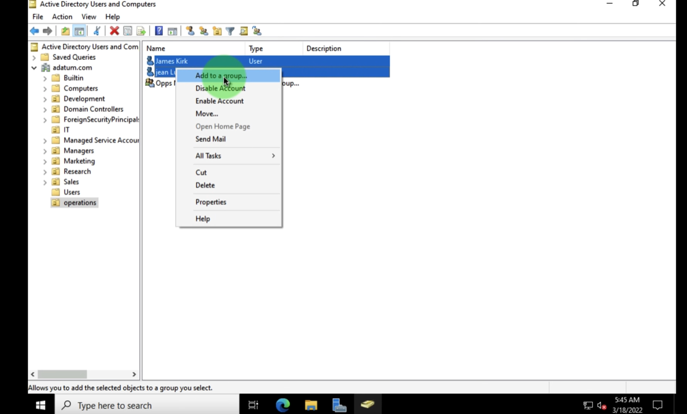

Right-clicking a user in ADUC provides quick actions:

| Action | Description |
|---|---|
| **Add to a group...** | Add user to one or more groups directly |
| **Disable Account** | Immediately prevent logon (account persists in AD) |
| **Enable Account** | Re-activate a disabled account |
| **Move...** | Move user to a different OU |
| **Reset Password** *(under All Tasks)* | Force a password reset |
| **Properties** | Full user attribute editor |

---

## 19. Selecting the Group — Select Groups Dialog

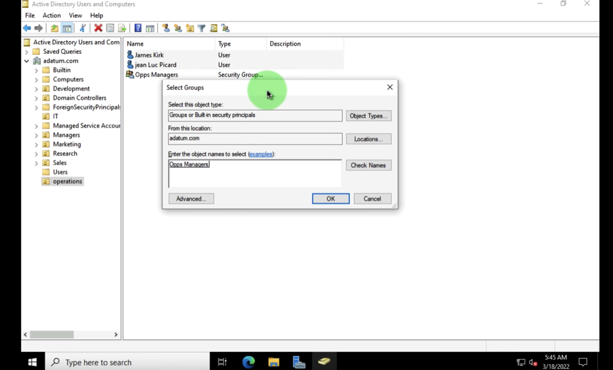

The **Select Groups** dialog searches for and selects group objects:

- **Select this object type:** Restricts search to Groups or Built-in security principals
- **From this location:** The domain or OU scope to search in — click **Locations** to search other domains
- **Enter object names:** Type the group name (partial names work). Click **Check Names** to resolve and validate.
- **Advanced:** Opens a full query builder for complex searches

> You can add a user to multiple groups at once by separating names with semicolons.

---

## 20. User Properties — Member Of Tab

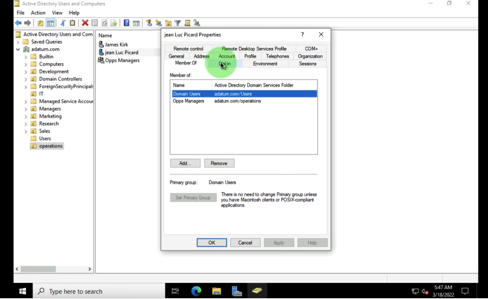

**Properties → Member Of** tab shows all groups the user belongs to.

| Field | Description |
|---|---|
| **Name** | Group name |
| **AD DS Folder** | Where the group lives in AD |
| **Primary group** | Defaults to `Domain Users` — only change for Mac/POSIX clients |

Buttons:
- **Add** — Add user to additional groups
- **Remove** — Remove from a group
- **Set Primary Group** — Only relevant for POSIX/Mac environments

###  Security Angle
The **Member Of** tab only shows **direct** memberships. If the user is in Group A, and Group A is nested inside Group B which has Domain Admin rights, you will not see that here. Always use recursive enumeration or BloodHound to see the full effective permission picture.

```powershell
# Recursive membership check
Get-ADGroupMember -Identity "Domain Admins" -Recursive | Select Name, SamAccountName
```

---

# PART 4 — AD Database and File System

---

## 21. The NTDS Folder Location

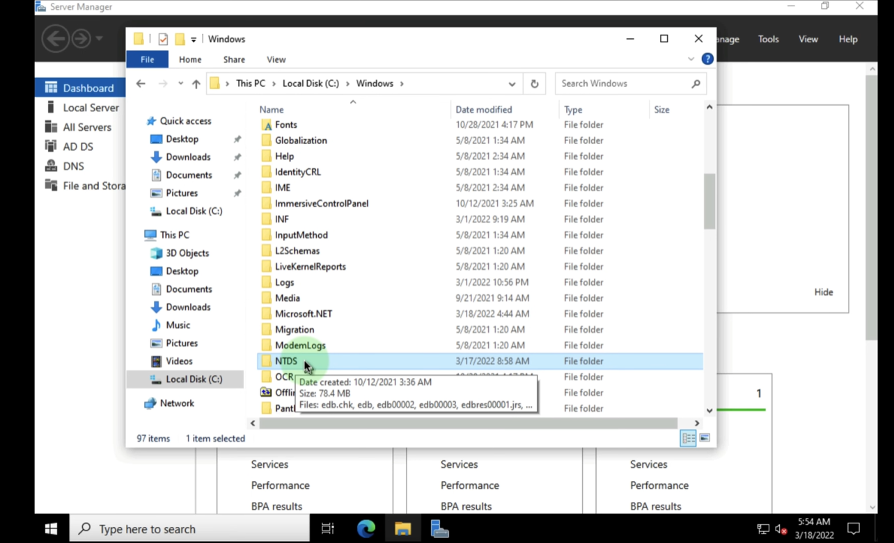

The Active Directory database lives at:

```
C:\Windows\NTDS\
```

The NTDS folder is **78.4 MB** in this example but grows as more objects are added. At enterprise scale, it can reach several gigabytes.

###  Why This Is the #1 Target on a DC
**If an attacker gets a copy of `ntds.dit` together with the SYSTEM registry hive, they can extract every password hash in the domain — offline.** No need to crack online, no lockouts, no alerts. Tools like `secretsdump.py` (Impacket) or `DSInternals` do this in minutes.

This is a full domain compromise. Every user's NTLM hash is exposed, including all admin accounts.

Protect the NTDS folder by:
- Restricting access to Domain Admins only
- Monitoring with **File System Auditing** (Event ID 4663)
- Enabling **Credential Guard** on DCs
- Using **Protected Users** security group for admin accounts

---

## 22. NTDS Database Files Explained

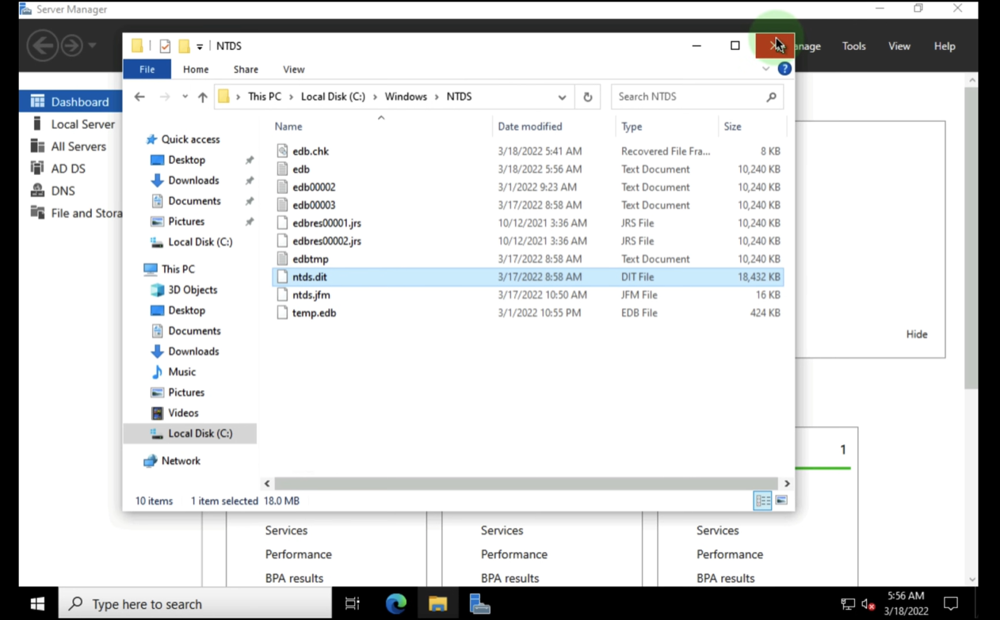

Inside `C:\Windows\NTDS\`:

| File | Type | Purpose |
|---|---|---|
| **ntds.dit** | DIT (Directory Information Tree) | The actual AD database. Stores all objects, attributes, and password hashes. 18 MB here — grows to GBs at scale. |
| **edb.chk** | Checkpoint file | Tracks which transaction log entries have been committed to ntds.dit. Used for recovery after a crash. |
| **edb / edb00002 / edb00003** | Transaction logs (10 MB each) | All changes are written here first (write-ahead logging) before being committed to ntds.dit. |
| **edbres00001.jrs / edbres00002.jrs** | Reserved log files | Pre-allocated emergency space — if disk fills up, AD uses these to gracefully shut down instead of corrupting the database. |
| **edbtmp** | Temp transaction log | Temporary log created during log rotation. |
| **ntds.jfm** | Jet engine metadata | Used by the Extensible Storage Engine (ESE) that underpins AD. |
| **temp.edb** | Temporary EDB | Scratch space for ongoing database operations. |

> **Never manually delete, move, or modify these files.** Use `ntdsutil` or Windows Server Backup for all legitimate database operations.

### How the Write Process Works

```
Change made in AD (e.g., password reset)
            ↓
Written to Transaction Log (edb######.log) — immediate
            ↓
Checkpoint updated (edb.chk)
            ↓
Lazily committed to ntds.dit
            ↓
Transaction log cleared or rolled over
```

This write-ahead logging means AD can recover cleanly after a power failure — uncommitted transactions are replayed from the logs.

---

# PART 5 — Sites and Services

---

## 23. Opening AD Sites and Services

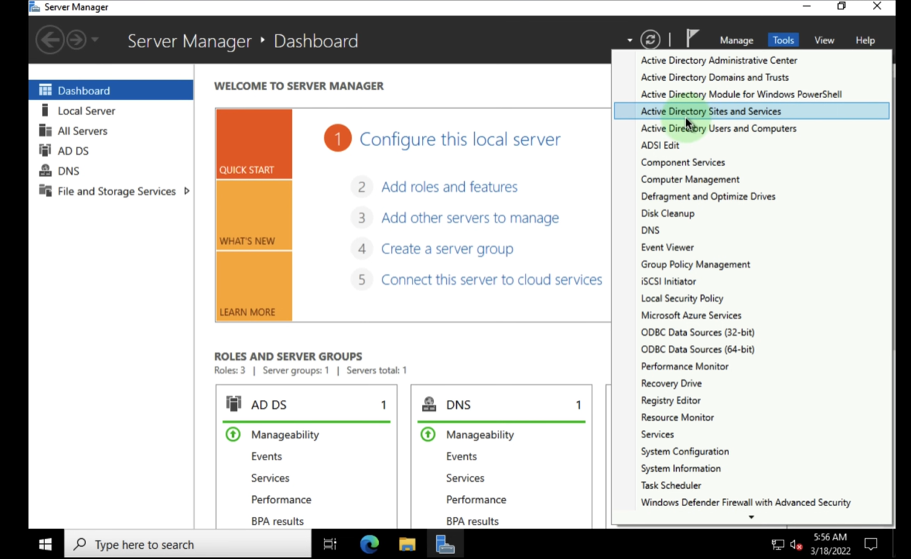

`Server Manager → Tools → Active Directory Sites and Services`

This tool manages the **physical network topology** of your AD deployment. While ADUC manages logical objects (users, groups), Sites and Services manages how those objects are **replicated across physical locations**.

---

## 24. NTDS Site Settings Properties

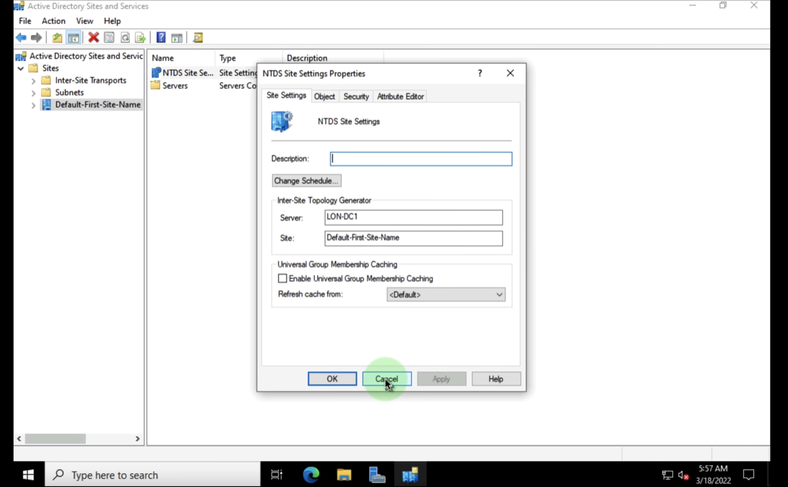

**NTDS Site Settings** is the per-site configuration object. Properties for `Default-First-Site-Name`:

**Change Schedule** — Set the replication schedule for intra-site replication (by default it is immediate/continuous for intra-site).

**Inter-Site Topology Generator (ISTG)**
- **Server:** `LON-DC1` — This DC is the ISTG for the site
- **Site:** `Default-First-Site-Name`
- The ISTG automatically calculates the most efficient replication paths between sites by running the **KCC (Knowledge Consistency Checker)** algorithm. It creates and maintains the Connection Objects between DCs.

**Universal Group Membership Caching**
- When enabled, a DC in this site caches universal group memberships locally
- Eliminates the need for a Global Catalog server in every branch site
- After the first authentication, the DC caches the result for the configured refresh interval
- Very useful for small branch offices with slow WAN links

---

## 25. NTDS Settings Right-Click Options

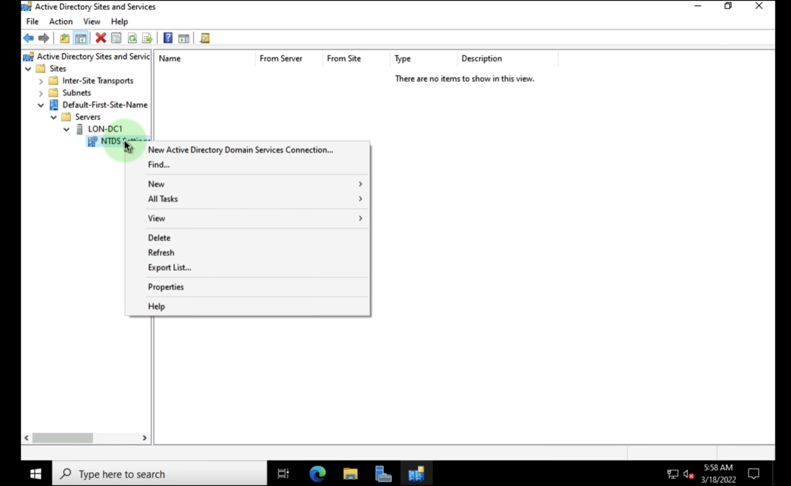

Right-clicking **NTDS Settings** under a server node (`LON-DC1 → NTDS Settings`) exposes:

**New Active Directory Domain Services Connection** — Manually create a replication connection object between this DC and another. Normally the KCC creates these automatically, but you can force manual connections for specific replication paths or troubleshooting.

**Properties** — Opens NTDS Settings where you can toggle **Global Catalog** status, set **Query Policy**, and view the **DNS Alias** (GUID-based CNAME record used for DC location).

> The Connection Objects visible when you expand a server show replication partnerships — which DC replicates from which, and on what schedule.

---

## 26. NTDS Settings — General Properties (Global Catalog)

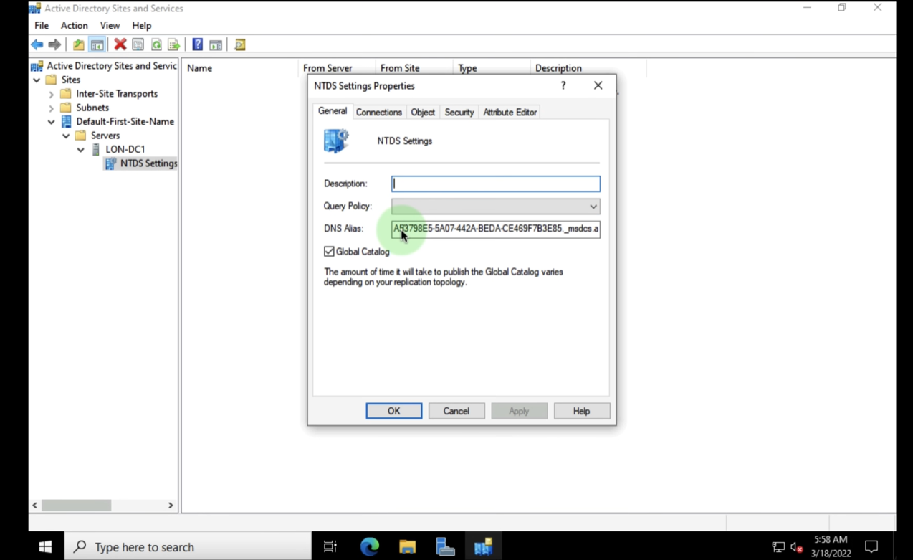

The NTDS Settings Properties for `LON-DC1`:

**Query Policy** — Limits LDAP query resources (result set size, time limits). The default policy is usually sufficient unless tuning for large LDAP queries.

**DNS Alias** — A GUID-based CNAME record in DNS pointing to this DC. Format: `<GUID>._msdcs.<forestname>`. Allows clients to locate the DC even if it is renamed.

**Global Catalog ✅**
- This DC hosts the Global Catalog (GC)
- The GC holds a **full replica of all objects in its own domain** plus a **partial replica of all objects in every other domain** in the forest
- Required for: universal group membership resolution, forest-wide searches, Exchange recipient lookups, UPN-based logon

> Every forest needs at least one GC. Best practice: make all DCs GC servers unless bandwidth is severely constrained.

###  Security Angle
The Global Catalog is a goldmine for attackers. A single LDAP query to a GC can enumerate all users, groups, and computers across the **entire forest**. After gaining a foothold, attackers routinely query GC servers on **port 3268** (GC) or **3269** (GC over SSL) for reconnaissance. Monitor for abnormal LDAP query volumes from non-DC sources.

---

## 27. Creating a New AD Site

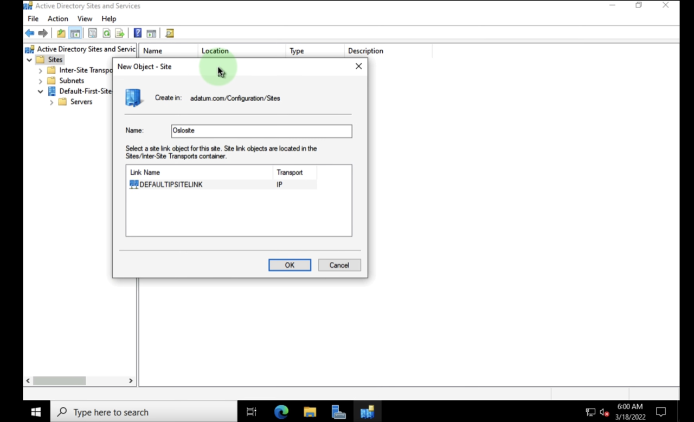

`Sites → right-click → New → Site` creates a new site object.

**New Object — Site** dialog:
- **Name:** `Oslosite` — typically named after the city or office location
- **Site Link:** Every site must be assigned to at least one site link object. The `DEFAULTIPSITELINK` (IP transport) is selected here.

Site links define:
- **Cost** — Lower cost = preferred path for replication
- **Replication interval** — How often replication runs between sites (minimum 15 minutes)
- **Schedule** — Which hours replication is allowed (to avoid peak business hours)

After creating the site, you need to:
1. Add **subnets** to the site so clients know which site they belong to
2. Move **servers** (DCs) into the site
3. Configure **site links** with appropriate cost and schedule

###  Security Angle
Sites affect **DC locator** behavior. If subnet-to-site mappings are wrong, clients may authenticate against a DC in a different city — sending credentials over a WAN link unnecessarily. Incorrect site configuration also means GPOs may not apply optimally and replication may be uncontrolled.

---

# PART 6 — Domains, Trusts, and Administrative Center

---

## 28. AD Domains and Trusts — Domain Properties

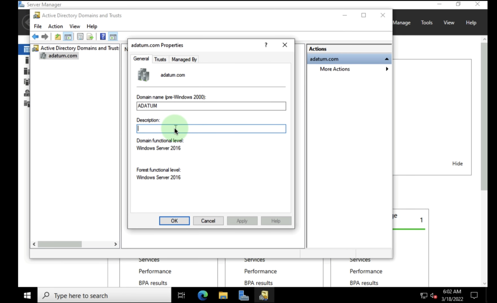

`Server Manager → Tools → Active Directory Domains and Trusts`

Right-clicking `adatum.com` and selecting **Properties** shows three tabs:

**General Tab:**
- **Domain name (pre-Windows 2000):** `ADATUM` — the NetBIOS name for legacy compatibility
- **Domain functional level:** `Windows Server 2016`
- **Forest functional level:** `Windows Server 2016`

**Functional Level Reference:**

| Level | Min DC OS | Notable Features Unlocked |
|---|---|---|
| Windows Server 2012 R2 | Server 2012 R2 | Protected Users group, Authentication Policies |
| Windows Server 2016 | Server 2016 | PAM (Privileged Access Management) trust features |
| Windows Server 2019/2022 | Server 2019/2022 | No additional AD features (improvements elsewhere) |

> Raising functional levels is **irreversible**. Once raised, you cannot add older DCs to the domain.

**Trusts Tab** — Create, verify, and remove trust relationships:
- External domain trusts (one-way or two-way)
- Forest trusts (forest-to-forest)
- Realm trusts (with non-Windows Kerberos realms like Linux MIT Kerberos)
- Shortcut trusts (optimize authentication paths within a forest)

###  Security Angle
Forest trusts are **extremely dangerous** if misconfigured. With a trust in place, **SID filtering** must be enforced to prevent **SID history attacks** where an attacker from the trusted domain injects a privileged SID into their token to gain admin access in the trusting domain. Always verify SID filtering is enabled on external trusts using `netdom trust`.

---

## 29. Active Directory Administrative Center (ADAC)

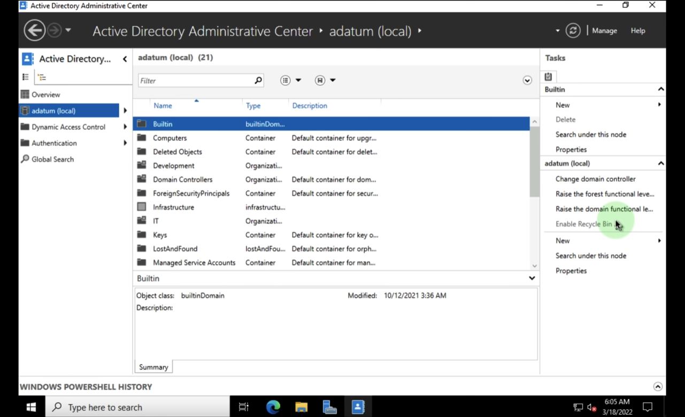

`Server Manager → Tools → Active Directory Administrative Center`

ADAC is the **modern AD management interface** introduced in Windows Server 2012. It is built entirely on PowerShell — every GUI action generates and executes a PowerShell command shown in the **Windows PowerShell History** panel at the bottom.

### Tasks Panel (Right Side) — Key Actions

| Task | What It Does |
|---|---|
| **Change domain controller** | Switch ADAC to connect to a different DC |
| **Raise the forest functional level** | Upgrade forest features (irreversible) |
| **Raise the domain functional level** | Upgrade domain features (irreversible) |
| **Enable Recycle Bin** | Allow recovery of deleted AD objects — one of the first things to enable on a new domain |
| **Search under this node** | Fast filter/search within the selected container |
| **Properties** | View and edit all attributes of selected objects |

### The AD Recycle Bin — Enable This Immediately

When enabled:
- Deleted objects (users, groups, OUs) are preserved in the **Deleted Objects** container
- They can be **restored with all attributes intact** — group memberships, permissions, everything
- Default retention period: 180 days
- **Cannot be disabled once enabled**

Without Recycle Bin, recovering a deleted user requires an authoritative restore from DC backup — a slow, painful process.

### PowerShell History Panel

This is an excellent learning tool. Every click in ADAC generates the equivalent PowerShell. For example, creating a user generates:

```powershell
New-ADUser -Name "Jean Luc Picard" `
           -SamAccountName "PicardJ" `
           -UserPrincipalName "PicardJ@adatum.com" `
           -Path "OU=operations,DC=adatum,DC=com" `
           -AccountPassword (ConvertTo-SecureString "P@ssw0rd" -AsPlainText -Force) `
           -Enabled $true
```

This is how you bridge GUI knowledge into automation.

###  Security Angle
**Enable the AD Recycle Bin immediately** after deploying a domain. Ransomware attacks and malicious insiders often delete AD objects — users, groups, and OUs — to cause maximum disruption. Without the Recycle Bin, recovery takes hours. With it, recovery takes seconds.

---

# PART 7 — Extra Knowledge & Security Deep Dives

---

##  The Most Common AD Attack Techniques

Understanding AD from a defender's perspective means knowing how attackers think. These are the techniques seen most often in real-world intrusions:

### Credential Attacks

**Pass-the-Hash (PtH)**
NTLM allows authentication with just the hash — no password needed. An attacker who extracts a hash from memory (via Mimikatz, lsass dump) can impersonate that user across the network for file shares, RDP, and more.

**Pass-the-Ticket (PtT)**
Kerberos tickets (TGTs, service tickets) are stolen from memory and reused on other machines. Mimikatz `sekurlsa::tickets` or Rubeus are common tools.

**Kerberoasting**
Any authenticated domain user can request a Kerberos service ticket for any account with an SPN. The ticket is encrypted with the service account's password hash. Attackers request these tickets and crack them offline. Accounts with weak passwords and SPNs are fully exposed.

```powershell
# Find all Kerberoastable accounts
Get-ADUser -Filter {ServicePrincipalName -ne "$null"} -Properties ServicePrincipalName, PasswordLastSet
```

**AS-REP Roasting**
For accounts with Kerberos pre-authentication disabled, an attacker requests a TGT without providing a valid password first. The KDC responds with material encrypted with the user's hash — crackable offline with Hashcat.

### Escalation Attacks

**DCSync**
An attacker with `Replicating Directory Changes All` permission mimics a DC and pulls password hashes from AD remotely. No code runs on the DC. Normally only DCs and Domain Admins have this right — but it is often accidentally granted.

**Golden Ticket**
If the `krbtgt` account hash is compromised, attackers forge Kerberos TGTs for any user, any group, valid for any duration. Resetting `krbtgt` **twice** with a waiting period between resets is required to invalidate all forged tickets.

**Silver Ticket**
Forged service tickets using a service account's hash. More limited scope than Golden Tickets but harder to detect since no communication with the DC occurs during use.

**AD CS Abuse (ESC1–ESC8)**
Certificate Services misconfigurations allow low-privilege users to enroll certificates that authenticate as Domain Admins. One of the fastest-growing attack vectors in enterprise environments.

---

##  AD Hardening Checklist

```
[ ] Enable AD Recycle Bin
[ ] Enable comprehensive audit logging (logon events, object access, privilege use)
[ ] Implement tiered admin model (Tier 0 = DCs/AD, Tier 1 = Servers, Tier 2 = Workstations)
[ ] Use PAWs (Privileged Access Workstations) for admin tasks
[ ] Never log into DCs with accounts used for daily work
[ ] Add privileged accounts to the Protected Users security group
[ ] Disable NTLM where possible — enforce Kerberos
[ ] Enable SMB signing on all systems to prevent relay attacks
[ ] Audit all accounts with "Password never expires"
[ ] Audit all accounts with Kerberos pre-auth disabled (AS-REP roasting)
[ ] Audit all accounts with SPNs set (Kerberoasting targets)
[ ] Run BloodHound — identify every path to Domain Admin
[ ] Run PingCastle or Purple Knight — get an AD health/risk score
[ ] Rotate krbtgt password every 180 days (or immediately after any suspected compromise)
[ ] Review and minimize all trust relationships
[ ] Audit AdminSDHolder and protected group memberships
[ ] Enable File System Auditing on C:\Windows\NTDS\
[ ] Use gMSA instead of regular service accounts wherever possible
[ ] Enable Fine-Grained Password Policies for admin accounts
[ ] Monitor for DCSync (Event ID 4662 with DS-Replication-Get-Changes-All)
[ ] Monitor for abnormal LDAP queries on ports 389, 636, 3268, 3269
[ ] Audit certificate templates in AD CS (run Certify or Certipy)
```

---

##  Key AD Terminology Reference

| Term | Definition |
|---|---|
| **DC (Domain Controller)** | Server running AD DS and handling authentication for the domain |
| **FSMO Roles** | Five special single-master operations roles in AD — Schema Master, Domain Naming Master, PDC Emulator, RID Master, Infrastructure Master |
| **PDC Emulator** | Authoritative time source for the domain; handles password changes, account lockouts, and legacy auth |
| **RID Master** | Allocates pools of Relative IDs to DCs so every new object gets a globally unique SID |
| **Global Catalog (GC)** | DC hosting partial replicas of all forest objects; required for UPN logon and Exchange |
| **SYSVOL** | Shared folder replicated across all DCs containing GPO files and logon scripts (replicated via DFS-R) |
| **GPO** | Group Policy Object — a set of configuration and security settings applied to OUs |
| **LDAP** | Lightweight Directory Access Protocol — used to query and modify AD (port 389 plain, 636 TLS) |
| **Kerberos** | Default AD authentication protocol using tickets (port 88) |
| **NTLM** | Legacy challenge-response authentication protocol — fallback when Kerberos fails |
| **SPN** | Service Principal Name — identifier for a service instance, used by Kerberos |
| **ACL / ACE** | Access Control List / Entry — defines permissions on AD objects |
| **AdminSDHolder** | Template object whose ACL is stamped onto protected group members every 60 minutes by SDProp |
| **KCC** | Knowledge Consistency Checker — algorithm that automatically builds the replication topology |
| **ISTG** | Inter-Site Topology Generator — DC responsible for creating intersite replication connection objects |
| **krbtgt** | The special account whose hash is used to encrypt all Kerberos TGTs in the domain |

---

##  Useful PowerShell AD Commands

```powershell
# Get all domain users
Get-ADUser -Filter * -Properties *

# Find accounts with password never expires
Get-ADUser -Filter {PasswordNeverExpires -eq $true} -Properties PasswordNeverExpires

# Find accounts with Kerberos pre-auth disabled (AS-REP roasting targets)
Get-ADUser -Filter {DoesNotRequirePreAuth -eq $true}

# Find all accounts with SPNs set (Kerberoasting targets)
Get-ADUser -Filter {ServicePrincipalName -ne "$null"} -Properties ServicePrincipalName

# Get all members of Domain Admins recursively
Get-ADGroupMember -Identity "Domain Admins" -Recursive | Select Name, SamAccountName

# Check replication health across all DCs
repadmin /replsummary

# Force replication from all DCs immediately
repadmin /syncall /AdeP

# Check which DC holds which FSMO role
netdom query fsmo

# Unlock a locked user account
Unlock-ADAccount -Identity "PicardJ"

# Reset a user password
Set-ADAccountPassword -Identity "PicardJ" -Reset -NewPassword (Read-Host -AsSecureString)

# Find all GPOs and their linked OUs
Get-GPO -All | Select DisplayName, GpoStatus

# Find stale computer accounts (not logged in for 90+ days)
$cutoff = (Get-Date).AddDays(-90)
Get-ADComputer -Filter {LastLogonDate -lt $cutoff} -Properties LastLogonDate | Select Name, LastLogonDate

# Find all admin accounts across the domain
Get-ADGroupMember -Identity "Domain Admins" -Recursive
Get-ADGroupMember -Identity "Enterprise Admins" -Recursive
Get-ADGroupMember -Identity "Schema Admins" -Recursive
```

---

> **More sections coming.** Topics to be added: Group Policy (GPO) deep dive, DNS integration with AD, Fine-Grained Password Policies (FGPP), Read-Only Domain Controllers (RODC), Kerberos delegation types (unconstrained / constrained / resource-based), and more.
